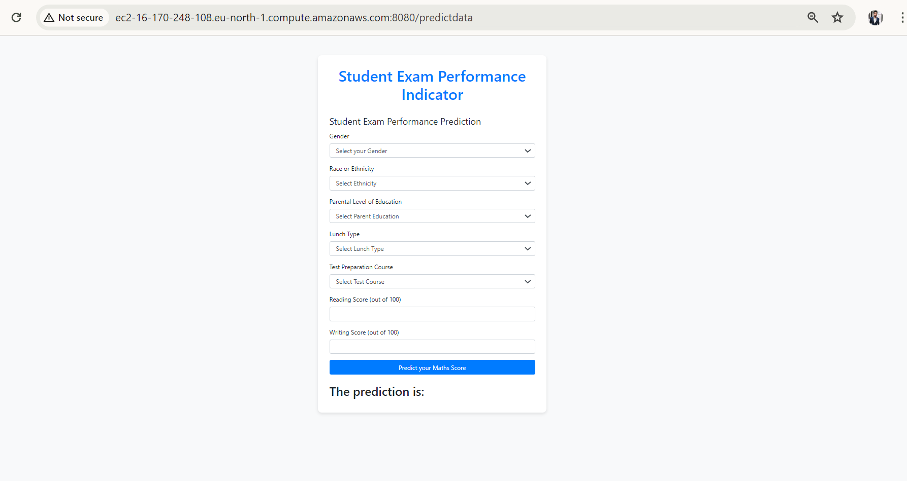

# Student performance Prediction End to END project 

##### Main purpose of this project to showcase End to End machine learning deployment.
##### we will be see how we can deploy end to end ml application using ci cd pipelines and github asction uing ECR and EC2 instance.
##### This Project show how to deploy a Dockerized application on AWS using CI/CD with GitHub Actions. The exact steps and configurations may vary based on your specific needs and AWS services used (e.g., ECS, EKS, or Elastic Beanstalk).

## Approach for Project:

### Github And Code Set Up
    -Setup github repo 
    -Create env 
          conda create -p venv python==3.8 -y
          conda activate venv/

### Project Structure, Logging And Exception Handling:

Link : [Logging](./src/logger.py)
Link : [Exception Handling](./src/exception.py)

### Project Problem Statement:

- This project understands how the student's performance (test scores) is affected by other       variables such as Gender, Ethnicity, Parental level of education, Lunch and Test preparation course.
    
- Dataset Source :
[https://www.kaggle.com/datasets/spscientist/students-performance-in-exams?datasetId=74977](https://www.kaggle.com/datasets/spscientist/students-performance-in-exams?datasetId=74977)

- The data consists of 8 column and 1000 rows.

### Data collection and Exploratory Data Analysis:

#### Steps
1. Data collection
2. Variable Identification 
3. Bi-variate Analysis
4. Missing values treatment
5. Outlier treatment
6. Variable transformation
7. Variable creation

Link : [EDA Notebook](./notebook/Basic_EDA.ipynb)

### Data Ingestion:

#### steps
1. Reading Data
2. Preparing Data
3. Storing Data

Link : [Data Ingestion](./src/components/data_ingestion.py)

### Data Transformation:

The purpose of pipeline automate the preprocessing of raw data into a format that is ready for machine learning. This includes handling missing values, scaling numerical data, and encoding categorical data. By saving the preprocessing pipeline, it ensures consistency in how data is transformed during both training and inference phases of the machine learning lifecycle.

Link : [Data Transformation](./src/components/data_transformation.py)

### Model Training Component:

The purpose of this module is to automate the process of training and evaluating multiple regression models to identify the best one. It involves splitting the data, training various models, evaluating their performance, selecting the best model, and saving it for future use. The process ensures that the chosen model is the most suitable for the given data based on its performance metrics.

Link : [Model Training](./src/components/model_trainer.py)

### Create Prediction Pipeline Using Flask Web APP:

The purpose of this module is to create a web interface for users to input data, process the data through a machine learning pipeline, and display the prediction results. The application allows users to interact with the machine learning model through a web browser, making it accessible and user-friendly.

Link : [Flask Web Code](./app.py)

### Deploy in Production on AWS Cloud Using Docker,CI CD Pipeline:

We have multiple tools and tech to deploy the project on product grade ,Here I am using using CI CD pipelines and github actions uing ECR and EC2 instance.

#### Steps:
Docker And Workflow Set up
Iam User Setup In AWS
ECR Repository set up
EC2 Instance set up
Docker Set up In EC2 instance
App runner set up
Run Workflow

#### Docker And Workflow Set up:

#### Login Into AWS

#### Create Iam User Setup In AWS :

#with specific access

1. EC2 access : It is virtual machine

2. ECR: Elastic Container registry to save your docker image in aws

#Policy:

1. AmazonEC2ContainerRegistryFullAccess

2. AmazonEC2FullAccess

#### Create ECR repo to store/save docker image :

save this url : 211125773837.dkr.ecr.eu-north-1.amazonaws.com/student_performance

#### Create EC2 machine (Ubuntu)
#### Open EC2 and Install docker in EC2 Machine:

#optional

sudo apt-get update -y

sudo apt-get upgrade

#required

curl -fsSL https://get.docker.com -o get-docker.sh

sudo sh get-docker.sh

sudo usermod -aG docker ubuntu

newgrp docker

#### Configure EC2 as self-hosted runner:

setting>actions>runner>new self hosted runner> choose os> then run command one by one

#### Setup github secrets:

AWS_ACCESS_KEY_ID=

AWS_SECRET_ACCESS_KEY=

AWS_REGION = us-east-1

AWS_ECR_LOGIN_URI = 

ECR_REPOSITORY_NAME = 

### AWS Deployment Link :

- App Link :
[http://ec2-16-170-248-108.eu-north-1.compute.amazonaws.com:8080/predictdata](http://ec2-16-170-248-108.eu-north-1.compute.amazonaws.com:8080/predictdata)

### Screenshot of UI:

